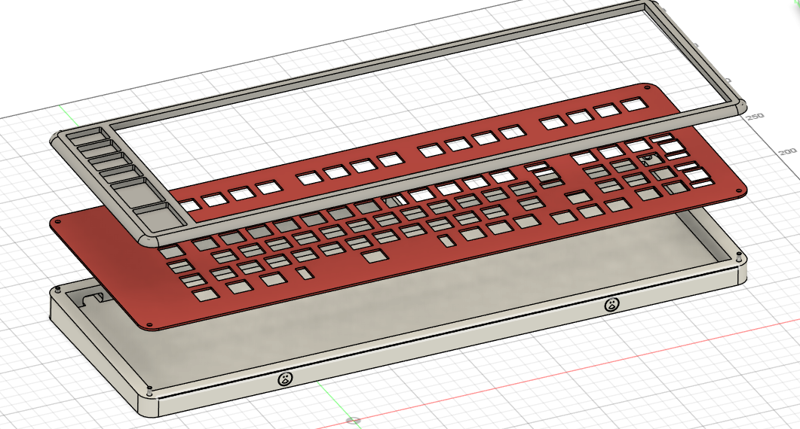
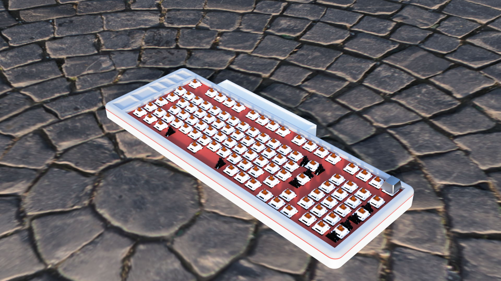
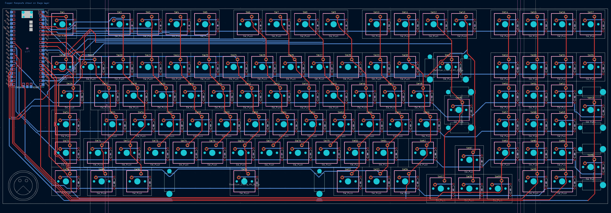
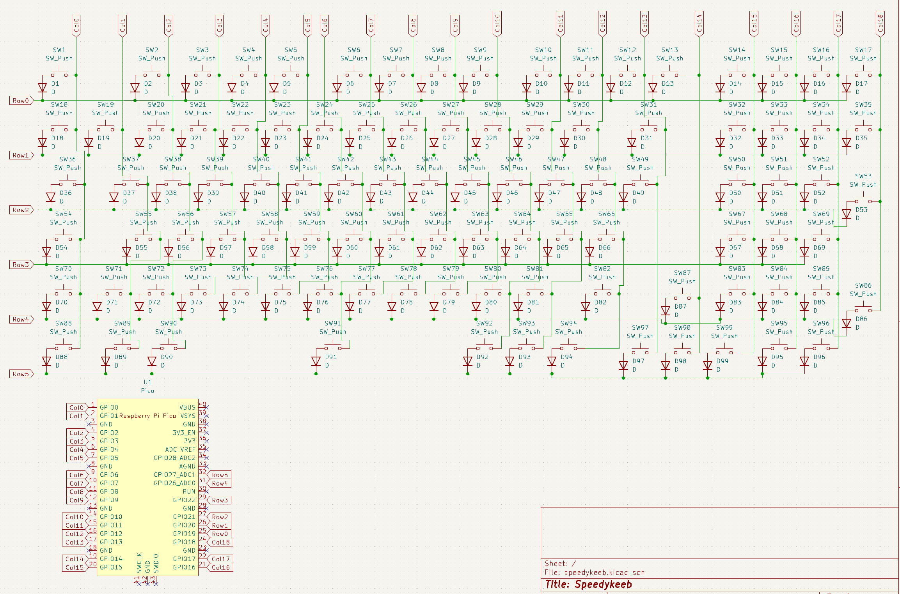

# Speedykeeb

This is my Keyboard. It has compartments on the left for screws and such and a compartment on the top for my Pinecil. The color style is inspired by the NES.

I made it becazse i really want a mechanical keyboard and always wanted to make one myself so it fits my requirements. So this was the perfect opportunity. 

# BOM
| Amount | Unit | Name                                                         | Prices (includes shipping) |
| ------ | ---- | ------------------------------------------------------------ | -------------------------- |
| 99     | pcs  | [Kailh Speed Silver Switches](https://www.kailh.net/products/kailh-speed-switch-set) |$41.36|
| 1      | Set  | [Keycaps](https://de.aliexpress.com/item/1005007393936770.html?spm=a2g0o.productlist.main.1.6e83SklISklIfh&algo_pvid=8f922a91-9d46-479a-a7ad-1119f3b1cfd9&algo_exp_id=8f922a91-9d46-479a-a7ad-1119f3b1cfd9-0&pdp_ext_f=%7B%22order%22%3A%22342%22%2C%22eval%22%3A%221%22%2C%22fromPage%22%3A%22search%22%7D&pdp_npi=6%40dis%21CHF%2119.87%2113.12%21%21%21174.87%21115.46%21%40211b615317598338857841921e25a4%2112000040566263788%21sea%21CH%210%21ABX%211%210%21n_tag%3A-29910%3Bd%3A8797b9fe%3Bm03_new_user%3A-29895%3BpisId%3A5000000174211148&curPageLogUid=JgAsSrX617K2&utparam-url=scene%3Asearch%7Cquery_from%3A%7Cx_object_id%3A1005007393936770%7C_p_origin_prod%3A) |~$19.86 (you know how aliexpress is)|
| 4      | pcs  | [M3x16mm Screws](https://de.aliexpress.com/item/1005006869763828.html?spm=a2g0o.productlist.main.3.446853ffXxUWEK&algo_pvid=02191f86-c1e0-4ab2-bf95-73a7dba9c152&algo_exp_id=02191f86-c1e0-4ab2-bf95-73a7dba9c152-2&pdp_ext_f=%7B%22order%22%3A%22482%22%2C%22eval%22%3A%221%22%2C%22fromPage%22%3A%22search%22%7D&pdp_npi=6%40dis%21USD%212.47%210.99%21%21%2117.51%217.01%21%402103868817605233411898521e239e%2112000051246159029%21sea%21CH%210%21ABX%211%210%21n_tag%3A-29910%3Bd%3A1e4b0ebc%3Bm03_new_user%3A-29895%3BpisId%3A5000000187455100&curPageLogUid=UUvFnOw1o7IX&utparam-url=scene%3Asearch%7Cquery_from%3A%7Cx_object_id%3A1005006869763828%7C_p_origin_prod%3A) |~$2.47|
| 4      | pcs  | [M3 Heat Inserts](https://de.aliexpress.com/item/4000232858343.html?gatewayAdapt=isr2deu) |~$7.26|
| 99     | pcs  | [Through Hole 1N4148 Diodes](https://de.aliexpress.com/item/1005006374599568.html?spm=a2g0o.productlist.main.5.5a95c80d3AwSV3&algo_pvid=e320d231-1e6e-4b0d-82fd-370e0c99d243&algo_exp_id=e320d231-1e6e-4b0d-82fd-370e0c99d243-4&pdp_ext_f=%7B%22order%22%3A%22134%22%2C%22eval%22%3A%221%22%2C%22fromPage%22%3A%22search%22%7D&pdp_npi=6%40dis%21USD%213.49%210.99%21%21%2124.72%216.99%21%402103892f17605230560555965e775a%2112000036944920067%21sea%21CH%210%21ABX%211%210%21n_tag%3A-29910%3Bd%3A1e4b0ebc%3Bm03_new_user%3A-29895%3BpisId%3A5000000187455099&curPageLogUid=4kYeh4UR9Gq8&utparam-url=scene%3Asearch%7Cquery_from%3A%7Cx_object_id%3A1005006374599568%7C_p_origin_prod%3A) |~$4.10|
| 1      | Set  | [Gateron PC Crystal Stabs](https://www.gateron.com/products/gateron-pc-crystal-stabilizer-set) |$12.85 |
| 1      | pcs  | Orpheus pico with headers                                    ||
| 1      | pcs  | PCB                                                          |$43.88|
| 1      | pcs  | Top Frame 3D Printed in Gray                                 ||
| 1      | pcs  | Plate 3D Printed in Red                                      ||
| 1      | pcs  | Bottom 3D Printed in Beige                                   ||

